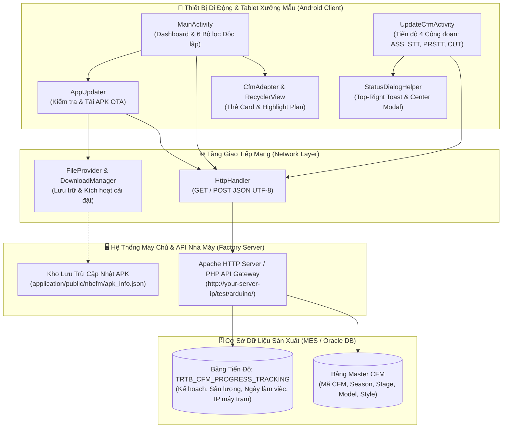

# 👟 NB CFM - Sample Production Tracking & Workshop Dashboard (v1.0)

> **Hệ Thống Quản Lý Kế Hoạch & Giám Sát Tiến Độ Sản Xuất Mẫu Giày New Balance (Enterprise Factory System)**  
> *Ứng dụng di động chuyên dụng Android Native (Java / Android SDK 34 / Min SDK 21) dành cho xưởng mẫu (Sample Workshop / Development Center).*

-3DDC84?style=for-the-badge&logo=android&logoColor=white)


-success?style=for-the-badge)


---

## 📋 Mục Lục (Table of Contents)

1. 📌 [Tổng Quan Dự Án (Project Overview)](#-1-tổng-quan-dự-án-project-overview)
2. 🎯 [Mục Tiêu Nghiệp Vụ Cốt Lõi (Core Business Objectives)](#-2-mục-tiêu-nghiệp-vụ-cốt-lõi-core-business-objectives)
3. 🏗️ [Kiến Trúc Kỹ Thuật & Công Nghệ (Tech Stack & Architecture)](#-3-kiến-trúc-kỹ-thuật--công-nghệ-tech-stack--architecture)
4. ✨ [Chi Tiết Tính Năng & Phân Hệ (Key Features & Modules)](#-4-chi-tiết-tính-năng--phân-hệ-key-features--modules)
   - 4.1. [Màn Hình Dashboard Tra Cứu & Lọc Đa Chiều (`MainActivity`)](#41-màn-hình-dashboard-tra-cứu--lọc-đa-chiều-mainactivity)
   - 4.2. [Thẻ CFM Card & Trạng Thái Highlight (`CfmAdapter`)](#42-thẻ-cfm-card--trạng-thái-highlight-cfmadapter)
   - 4.3. [Quản Lý & Xóa Kế Hoạch Hàng Loạt Thông Minh (Bulk Delete Plan)](#43-quản-lý--xóa-kế-hoạch-hàng-loạt-thông-minh-bulk-delete-plan)
   - 4.4. [Cập Nhật Tiến Độ & Kế Hoạch 4 Công Đoạn (`UpdateCfmActivity`)](#44-cập-nhật-tiến-độ--kế-hoạch-4-công-đoạn-updatecfmactivity)
   - 4.5. [Theo Dõi Lịch Sử Tích Lũy Theo Ngày (Daily History & Audit IP)](#45-theo-dõi-lịch-sử-tích-lũy-theo-ngày-daily-history--audit-ip)
   - 4.6. [Hệ Thống Thông Báo Hiện Đại (`StatusDialogHelper`)](#46-hệ-thống-thông-báo-hiện-đại-statusdialoghelper)
   - 4.7. [Tự Động Cập Nhật Ứng Dụng Nội Bộ OTA (`AppUpdater`)](#47-tự-động-cập-nhật-ứng-dụng-nội-bộ-ota-appupdater)
5. 🌐 [Đặc Tả Giao Tiếp Backend API (API Specifications)](#-5-đặc-tả-giao-tiếp-backend-api-api-specifications)
6. 🗄️ [Mô Hình Dữ Liệu Cốt Lõi (Data Model)](#-6-mô-hình-dữ-liệu-cốt-lõi-data-model)
7. 📂 [Cấu Trúc Thư Mục Dự Án (Directory Structure)](#-7-cấu-trúc-thư-mục-dự-án-directory-structure)
8. 🚀 [Hướng Dẫn Cài Đặt & Môi Trường Phát Triển (Setup & Build)](#-8-hướng-dẫn-cài-đặt--môi-trường-phát-triển-setup--build)
9. 📦 [Quy Trình Build Tự Động & Đóng Gói Phân Phối (CI/CD & Deployment)](#-9-quy-trình-build-tự-động--đóng-gói-phân-phối-cicd--deployment)
10. 🛠️ [Xử Lý Lỗi Thường Gặp (Troubleshooting & FAQs)](#-10-xử-lý-lỗi-thường-gặp-troubleshooting--faqs)
11. 📸 [Tài Liệu & Hình Ảnh Đính Kèm (Docs & Media)](#-11-tài-liệu--hình-ảnh-đính-kèm-docs--media)
12. 📝 [Giấy Phép & Thông Tin Phát Triển (License & Authors)](#-12-giấy-phép--thông-tin-phát-triển-license--authors)

---

## 📌 1. Tổng Quan Dự Án (Project Overview)

**NB CFM Sample Production Tracking** là giải pháp phần mềm di động (Android Native) được phát triển riêng biệt cho quy trình sản xuất mẫu (Sample Making Workshop) và trung tâm phát triển kỹ thuật (R&D / Development Center) thuộc các nhà máy sản xuất giày thể thao đối tác của **New Balance (NB)**.

Trong chu kỳ phát triển sản phẩm giày dép xuất khẩu, mỗi dòng giày phải trải qua nhiều vòng thử nghiệm mẫu (CFM - Confirmation Sample, Commercial Factory Model, Proto 1, Proto 2, Wear Test, Sales Sample...). Quá trình này đòi hỏi sự phối hợp chặt chẽ giữa đội ngũ **VS Developer**, **Site Developer**, các chuyền làm mẫu và ban quản lý xưởng.

Ứng dụng giúp số hóa 100% quy trình:
- Thay thế hoàn toàn bảng theo dõi giấy tờ và file Excel rời rạc tại xưởng mẫu.
- Cho phép trưởng bộ phận, kỹ thuật viên và quản lý chuyền tra cứu nhanh chóng kế hoạch và sản lượng thực tế theo thời gian thực trên điện thoại / tablet Android.
- Nhập và tích lũy số liệu sản xuất hàng ngày theo từng công đoạn kỹ thuật với cơ chế kiểm soát lỗi chặt chẽ.

---

## 🎯 2. Mục Tiêu Nghiệp Vụ Cốt Lõi (Core Business Objectives)

1. **Kiểm Soát Tiến Độ 4 Công Đoạn Sản Xuất Cốt Lõi:**
   - **CUT (Cutting - Chặt / Cắt vật liệu):** Cắt định hình da, vải, đế và các linh kiện cấu thành giày.
   - **PRSTT (Pre-stitching - Chuẩn bị may / Tiền may):** Lạng mép, dán ép nhiệt, bồi keo, gấp mép linh kiện trước khi ráp.
   - **STT (Stitching - May mũ giày):** May ráp hoàn chỉnh toàn bộ thân trên (Upper).
   - **ASS (Assembly - Gò ráp & Ép đế):** Gò mũi, ráp đế ngoài (Outsole) và hoàn thiện đôi giày mẫu thành phẩm.

2. **Ràng Buộc Nghiệp Vụ Chặt Chẽ (Zero Data Inconsistency):**
   - **Ràng buộc Kế hoạch trước Sản xuất:** Không cho phép nhập sản lượng sản xuất (`Production QTY > 0`) khi quy trình đó chưa có số lượng kế hoạch (`Plan QTY <= 0`).
   - **Ràng buộc Trần Số Lượng Yêu Cầu (`Requested QTY Limit`):** Tổng kế hoạch tích lũy hoặc tổng sản lượng tích lũy của từng công đoạn không được phép vượt quá hạn mức mẫu thương hiệu yêu cầu (`REQUESTED_QTY` / `QTY_WORKING`).
   - **Kiểm soát giá trị âm:** Ngăn chặn nhập số âm hoặc các ký tự lỗi toán học.

3. **Tra Cứu Nhanh Chóng Với Bộ Lọc Đa Chiều Không Ràng Buộc (Independent Filtering):**
   - Hỗ trợ tìm kiếm độc lập theo **6 trường**: Season (Mùa), Style No (Mã số thiết kế), Stage (Công đoạn mẫu), Model Name (Tên dòng giày), Team (Tổ làm mẫu), Dev (Kỹ sư phát triển).
   - Lọc nhanh theo tình trạng lập kế hoạch: **Tất cả**, **Có Plan**, **Chưa có Plan**.

4. **Quản Lý Kế Hoạch Hàng Loạt & Phân Quyền Xóa Linh Hoạt:**
   - Hỗ trợ chọn nhanh toàn bộ CFM đã có kế hoạch (`Select All Has Plan`).
   - Hộp thoại xóa thông minh (`Bulk Delete Plan`): Tự động kiểm tra xem các CFM được chọn đã có dữ liệu sản lượng thực tế trong bảng `TRTB_CFM_PROGRESS_TRACKING` hay chưa.
   - Cung cấp 2 cơ chế linh hoạt:
     - **Chỉ xóa Kế hoạch (`DELETE_CFM_PLAN_BULK`):** Giữ nguyên số lượng thực tế đã sản xuất.
     - **Xóa Kế hoạch + Reset Sản lượng (`DELETE_CFM_PLAN_AND_PROD_BULK`):** Đưa toàn bộ về trạng thái ban đầu.

5. **Ghi Nhận Địa Chỉ IP Máy Trạm Để Truy Vết (Audit Trail):**
   - Tự động lấy địa chỉ IPv4 nội bộ (`NetworkInterface`) của thiết bị thao tác và gửi kèm bản ghi lưu tiến độ để bảo đảm tính minh bạch khi có sai số giữa các ca kíp.

---

## 🏗️ 3. Kiến Trúc Kỹ Thuật & Công Nghệ (Tech Stack & Architecture)

### 3.1. Bảng Công Nghệ Lựa Chọn (Technology Stack)

| Thành Phần | Công Nghệ Lựa Chọn | Phiên Bản | Ghi Chú & Mục Đích Sử Dụng |
| :--- | :--- | :--- | :--- |
| **Nền tảng** | **Android Native** | Java 8 / API 21 - 34 | Tương thích từ Android 5.0 (Lollipop) đến Android 14 mới nhất. |
| **Hệ thống Build** | **Gradle / AGP** | Gradle 7.2.2 | Tự động sinh `versionCode`, `versionName` và file APK theo chuẩn. |
| **Giao diện & UI** | **Material Components & AndroidX** | 1.11.0 / 1.6.1 | Bố cục hiện đại, CardView, AutoCompleteTextView, RecyclerView mượt mà. |
| **Hiệu ứng Tải** | **Facebook Shimmer** | 0.5.0 | Hiệu ứng xương lấp lánh (Skeleton loading) khi gọi API tải danh sách. |
| **Giao tiếp Mạng** | **HttpURLConnection (REST Client)** | Thuần Java (`HttpHandler`) | Thực hiện gọi GET / POST JSON với timeout 15s và xử lý mã hóa URL. |
| **Cài đặt Tự động** | **Android DownloadManager & FileProvider** | Native AndroidX | Quản lý tải xuống APK ngầm và cài đặt ứng dụng không gián đoạn. |
| **Bảng màu Nhận diện** | **New Balance Brand Palette** | Hex Colors | Màu chủ đạo: Đỏ NB (`#C8102E`), Đỏ sẫm (`#A00C24`), Nền xám (`#F2F3F5`). |

### 3.2. Sơ Đồ Kiến Trúc Hệ Thống (System Architecture)



---

## ✨ 4. Chi Tiết Tính Năng & Phân Hệ (Key Features & Modules)

### 4.1. Màn Hình Dashboard Tra Cứu & Lọc Đa Chiều (`MainActivity`)

- **6 Ô Gợi Ý Tự Động (AutoCompleteTextView):**
  - **Season:** Danh sách mùa phát triển tiêu chuẩn cố định từ `S127` đến `S235`.
  - **Stage:** Tải danh sách công đoạn mẫu từ server kết hợp các công đoạn chuẩn: `1ST PROTO`, `2ND PROTO`, `3RD PROTO`, `PROTO 0`, `Pullover`, `PROJECT CFM`, `PRODUCTION CFM`, `WEAR TEST`, `SALES SAMPLE`, `EXT`, `XTR`.
  - **Style No & Model Name:** Nạp độc lập và song song toàn bộ mã giày từ cơ sở dữ liệu (`Config.GET_STYLES`, `Config.GET_MODELS`).
  - **Team & Dev:** Tra cứu theo tổ sản xuất mẫu (`getcfmteams`) và nhân sự phụ trách (`getcfmdevs`).
- **Bộ Lọc Phân Loại Kế Hoạch (Plan Status Filter Spinner):**
  - `Tất cả`: Hiển thị toàn bộ kết quả phù hợp.
  - `Có Plan`: Chỉ hiển thị các mẫu CFM đã được lên kế hoạch sản xuất (`hasPlan == 1`).
  - `Chưa có Plan`: Hiển thị các mẫu đang chờ phân bổ kế hoạch.
- **Hiệu Ứng Shimmer (Loading State):**
  - Trong lúc dữ liệu tải qua mạng, giao diện hiển thị 4 thẻ placeholder xám với hiệu ứng ánh sáng quét ngang (`Facebook Shimmer`), loại bỏ cảm giác chờ đợi đơ cứng.
- **Thống Kê Tổng Số (Total Count):**
  - Nhãn hiển thị kết quả theo định dạng nổi bật: `Total: [X] CFM records` màu đỏ thương hiệu New Balance (`#C8102E`).

### 4.2. Thẻ CFM Card & Trạng Thái Highlight (`CfmAdapter`)

Mỗi dòng dữ liệu được hiển thị dưới dạng **Material CardView** với thiết kế công nghiệp rõ ràng:
- **Nhận Diện Trạng Thái:**
  - Nếu CFM đã có kế hoạch (`hasPlan == 1`): Nền thẻ tự động chuyển sang màu **Xanh Lá Nhạt (`#E8F5E9`)** cùng tiêu đề phụ `CFM ID: [Mã] (Has Plan)`.
  - Nếu CFM chưa có kế hoạch: Nền thẻ màu trắng tiêu chuẩn (`#FFFFFF`).
- **Khối Thông Tin Kỹ Thuật:**
  - Nhóm nổi bật: **Season**, **Model Name**, **Current Stage**, **Style No**, **Qty Working**.
  - Lưới 2 cột phụ trợ: **Brand Code**, **Gender**, **Last Name**, **TP Date** (Ngày xuất mẫu mục tiêu), **Mold New / Mold Exist**, **VS Dev**, **Site Dev**, **Spec Issue**, **Mtl Arrived**, **Qty Shipping**.

### 4.3. Quản Lý & Xóa Kế Hoạch Hàng Loạt Thông Minh (Bulk Delete Plan)

- **Nút "Chọn Tất Cả Có Plan" (`btnSelectAll`):**
  - Tự động bật/tắt toàn bộ checkbox của các mẫu CFM đã có kế hoạch. Nút tự động chuyển màu xanh đậm (`#1565C0`) khi có item khả dụng và chuyển xám khi không có.
- **Nút "Xóa Kế Hoạch" (`btnDeletePlan`):**
  - Kích hoạt khi có ít nhất 1 CFM được tick chọn, hiển thị màu đỏ cảnh báo (`#C62828`).
- **Hộp Thoại Xác Nhận Đa Tình Huống (`dialog_confirm_delete_plan`):**
  - Hiển thị danh sách cuộn các CFM được chọn kèm huy hiệu cảnh báo `ĐÃ CÓ SX` nếu CFM đó đã phát sinh sản lượng thực tế trong hệ thống.
  - **Trường hợp 1 (Chưa có sản lượng):** Hiển thị nút **"XÓA KẾ HOẠCH"** (`DELETE_CFM_PLAN_BULK`).
  - **Trường hợp 2 (Đã có sản lượng):** Cung cấp 2 lựa chọn thông minh:
    - `CHỈ XÓA KH`: Xóa kế hoạch nhưng bảo lưu sản lượng thực tế.
    - `XÓA KH + SX`: Xóa sạch kế hoạch và đưa sản lượng về 0 (`DELETE_CFM_PLAN_AND_PROD_BULK`).

### 4.4. Cập Nhật Tiến Độ & Kế Hoạch 4 Công Đoạn (`UpdateCfmActivity`)

Màn hình cập nhật chi tiết tiến độ dành cho quản lý xưởng:
- **Chọn Ngày Làm Việc (`Work Date Picker`):**
  - Mặc định là ngày hiện tại (`YYYY-MM-DD`). Cho phép bấm vào để mở `DatePickerDialog` chọn bất kỳ ngày nào để xem hoặc bổ sung số liệu.
- **Bảng 4 Công Đoạn Kỹ Thuật:**
  1. **ASS (Assembly):** Gò ráp, dán đế, hoàn thiện thành phẩm.
  2. **STT (Stitching):** May ghép các chi tiết mũ giày.
  3. **PRSTT (Pre-stitching):** Chuẩn bị may, ép nhiệt, định hình.
  4. **CUT (Cutting):** Chặt định hình chi tiết.
- **Cơ Chế Tính Toán Tức Thì (Real-time Live Calculation):**
  - Lắng nghe sự kiện gõ phím (`TextWatcher`) trên từng ô nhập Plan và Prod.
  - Tự động cộng dồn số lượng nhập hôm nay với số lượng của các ngày trước (`otherPlanAcc` / `otherProdAcc`) để hiển thị nhãn:
    - `Hôm nay (KH/SX): [Plan] / [Prod]`
    - `Tích lũy (KH/SX): [Tổng Plan] / [Tổng Prod]`
- **Kiểm Soát Tính Hợp Lệ Dữ Liệu (Validation Rules):**
  - Không cho phép nhập số âm.
  - Nếu `Prod QTY > 0` mà `Plan QTY <= 0` -> Kích hoạt hộp thoại cảnh báo: *"Quy trình [Tên] chưa có số lượng Kế hoạch"*.
  - Nếu tổng Plan hoặc tổng Prod tích lũy vượt quá `Requested QTY` của CFM -> Kích hoạt cảnh báo vượt trần hạn mức.

### 4.5. Theo Dõi Lịch Sử Tích Lũy Theo Ngày (Daily History & Audit IP)

- **Xem Chi Tiết Lịch Sử Từng Ngày (Nút Info `[i]`):**
  - Bấm vào biểu tượng thông tin cạnh mỗi quy trình để mở hộp thoại thống kê.
  - Hiển thị 2 thẻ Card tổng hợp: **TỔNG KẾ HOẠCH** và **TỔNG SẢN XUẤT** so với `Requested QTY`.
  - Danh sách bảng chi tiết từng lượt nhập gồm: **Ngày làm việc**, **Giờ cập nhật**, **Số lượng Kế hoạch**, **Số lượng Sản xuất**.
- **Ghi Nhận Địa Chỉ IP (`Audit Trail`):**
  - Hàm `getLocalIpAddress()` duyệt qua `NetworkInterface` của thiết bị để lấy địa chỉ IP LAN nội bộ của máy trạm/tablet.
  - Địa chỉ IP được đóng gói trong JSON gửi lên server (`body.put("IP", localIp)`) để hệ thống máy chủ ghi lại dấu vết thiết bị nào đã thực hiện lưu số liệu.

### 4.6. Hệ Thống Thông Báo Hiện Đại (`StatusDialogHelper`)

Ứng dụng không sử dụng các hộp thoại Toast mặc định dễ bị che khuất mà sử dụng bộ thông báo tùy chỉnh chuyên nghiệp:
1. **Thông Báo Thành Công (Top-Right Sliding Banner):**
   - Banner bo góc nền xanh lá mạ với icon checkmark xuất hiện góc trên bên phải màn hình.
   - Hiệu ứng trượt xuống mượt mà (`Slide down & Fade in` với `DecelerateInterpolator`).
   - Tự động biến mất sau **3.2 giây** hoặc có thể bấm dấu **"X"** để đóng ngay.
2. **Hộp Thoại Cảnh Báo & Báo Lỗi (Center Popup Modal):**
   - Hiển thị chính giữa màn hình với nền làm mờ (`dimBackground`).
   - Phân biệt trực quan qua màu sắc và icon:
     - **Cảnh báo (Warning):** Vòng tròn icon màu vàng cam hổ phách kèm nút *"HIỂU RỒI"*.
     - **Báo lỗi (Error):** Vòng tròn icon màu đỏ nổi bật kèm nút *"ĐÓNG"*.
   - Hạn chế tối đa chiều rộng tối đa 380dp, tối ưu cho cả màn hình điện thoại lẫn tablet công nghiệp.

### 4.7. Tự Động Cập Nhật Ứng Dụng Nội Bộ OTA (`AppUpdater`)

Giải pháp triển khai không cần Google Play Store dành riêng cho môi trường sản xuất khép kín của nhà máy:
- **Cơ Chế Kiểm Tra Phiên Bản:**
  - Mỗi khi khởi động `MainActivity`, ứng dụng ngầm gọi API `Config.CHECK_UPDATE` (`apk_info.json`).
  - Trích xuất `version_code`, `version_name`, `apk_url` và `changelog`.
  - Nếu `serverVersionCode > currentVersionCode`, hiển thị hộp thoại thông báo cập nhật không thể hủy (`setCancelable(false)`).
- **Tải Xuống & Cài Đặt Không Gián Đoạn:**
  - Xóa file APK tạm cũ để tiết kiệm bộ nhớ cho máy trạm.
  - Sử dụng Android `DownloadManager` tải ngầm file `nbcfm.apk` vào thư mục riêng của app (`DIRECTORY_DOWNLOADS`).
  - Đăng ký `BroadcastReceiver` đón sự kiện `ACTION_DOWNLOAD_COMPLETE`.
  - Sử dụng **FileProvider** (`com.example.nbcfm.fileprovider`) để kích hoạt `Intent.ACTION_VIEW` cài đặt bản cập nhật an toàn.
  - Tương thích từ Android 8.0 trở lên: Tự động điều hướng xin quyền `ACTION_MANAGE_UNKNOWN_APP_SOURCES` nếu chưa được cấp phép.

---

## 🌐 5. Đặc Tả Giao Tiếp Backend API (API Specifications)

Hệ thống kết nối trực tiếp với cổng API Gateway của nhà máy tại địa chỉ nội bộ:  
**Base URL:** `http://<SERVER_IP>/test/arduino/` *(thay `<SERVER_IP>` bằng địa chỉ IP server API nội bộ)*

| Tên Endpoint | Phương Thức | Tham Số Truyền Vào | Định Dạng Dữ Liệu Trả Về | Chức Năng Chính |
| :--- | :---: | :--- | :--- | :--- |
| `getcfmseasons` | `GET` | Không | JSON Array `["S127", "S227", ...]` | Lấy danh sách các mùa sản xuất |
| `getcfmstages` | `GET` | Không | JSON Array `[{"CURRENT_STAGE": "..."}]` | Lấy danh sách các công đoạn mẫu hiện có |
| `getcfmstyles` | `GET` | Không | JSON Array `[{"STYLE_NO": "..."}]` | Lấy toàn bộ danh sách Style Number |
| `getcfmmodels` | `GET` | `season` (tùy chọn) | JSON Array `[{"MODEL_NAME": "..."}]` | Lấy danh sách tên dòng giày Model |
| `getcfmteams` | `GET` | Không | JSON Array `[{"TEAM": "..."}]` | Lấy danh sách tổ làm mẫu xưởng |
| `getcfmdevs` | `GET` | Không | JSON Array `[{"DEVELOPER": "..."}]` | Lấy danh sách kỹ sư phát triển phụ trách |
| `getcfmlist` | `GET` | `season`, `stage`, `model`, `styleno`, `team`, `developer` | JSON Array chứa các đối tượng `CfmItem` | Truy vấn danh sách CFM theo điều kiện lọc |
| `getcfmdailyprogress` | `GET` | `cfmid`, `workdate` (YYYY-MM-DD) | JSON Object | Lấy kế hoạch, sản lượng và tích lũy theo ngày |
| `savecfmdailyprogress` | `POST` | Body JSON (CFM_ID, WORK_DATE, IP, ASS_PLAN, ASS_PROD, STT_PLAN, STT_PROD...) | `{"result":"OK"}` hoặc `{"result":"ERR","msg":"..."}` | Lưu số liệu tiến độ 4 công đoạn |
| `getcfmdailyhistory` | `GET` | `cfmid`, `process` (ASS/STT/PRSTT/CUT) | JSON Array các lượt nhập theo ngày | Lấy lịch sử chi tiết cho popup thông tin `[i]` |
| `deletecfmplan_bulk` | `POST` | `{"CFM_IDS": ["ID1", "ID2"]}` | `{"result":"OK"}` | Xóa hàng loạt kế hoạch (giữ lại sản lượng) |
| `deletecfmplan_and_prod_bulk`| `POST` | `{"CFM_IDS": ["ID1", "ID2"]}` | `{"result":"OK"}` | Xóa hàng loạt kế hoạch VÀ reset sản lượng về 0 |
| `application/public/nbcfm/apk_info.json` | `GET` | Không | `{"version_code": 123, "version_name": "...", "apk_url": "...", "changelog": "..."}` | Kiểm tra thông tin phiên bản APK mới nhất |

---

## 🗄️ 6. Mô Hình Dữ Liệu Cốt Lõi (Data Model)

### 6.1. Đối Tượng CFM Item (`CfmItem.java`)

Ánh xạ trực tiếp từ cơ sở dữ liệu mẫu xưởng:

```java
public class CfmItem implements Serializable {
    public String cfmId;         // Mã định danh duy nhất của mẫu CFM
    public String brandCode;     // Mã thương hiệu (NB, New Balance...)
    public String season;        // Mùa phát triển (S127, S227...)
    public String modelName;     // Tên dòng giày mẫu
    public String styleNo;       // Mã phong cách (Style Number)
    public String lastName;      // Tên phom giày (Shoe Last)
    public String moldNew;       // Khuôn mẫu mới
    public String moldExist;     // Khuôn mẫu hiện hữu
    public String gender;        // Phân loại giới tính (Men/Women/Unisex)
    public String vsDeveloper;   // Kỹ sư phát triển đại diện văn phòng (VS)
    public String siteDeveloper; // Kỹ sư phát triển tại nhà máy (Site)
    public String currentStage;  // Công đoạn mẫu hiện tại
    public String tpDate;        // Ngày gửi mẫu mục tiêu (Target Production Date)
    public String specIssue;     // Ngày phát hành tài liệu kỹ thuật Spec
    public String mtlArrived;    // Trạng thái / Ngày vật tư về xưởng
    public String qtyWorking;    // Số lượng mẫu yêu cầu xưởng thực hiện (Requested Qty)
    public String qtyShipping;   // Số lượng mẫu xuất xưởng
    public int hasPlan;          // 1: Đã lập kế hoạch; 0: Chưa lập kế hoạch
    public int isOverdue;        // 1: Quá hạn TP Date; 0: Bình thường
    public int hasProdData;      // 1: Đã có sản lượng sản xuất thực tế trong DB
    public boolean isSelected;   // Trạng thái checkbox trên giao diện
}
```

### 6.2. Cấu Trúc Bảng Tiến Độ Cơ Sở Dữ Liệu (`TRTB_CFM_PROGRESS_TRACKING`)

Bảng ghi nhận tiến độ hàng ngày trên hệ thống cơ sở dữ liệu:

| Tên Cột DB | Kiểu Dữ Liệu | Ràng Buộc | Ý Nghĩa Nghiệp Vụ |
| :--- | :--- | :--- | :--- |
| `CFM_ID` | `VARCHAR2(50)` | Primary Key | Mã mẫu CFM |
| `WORK_DATE` | `VARCHAR2(8)` | Primary Key | Ngày làm việc định dạng `YYYYMMDD` |
| `CUT_PLAN` | `NUMBER(8,0)` | Default 0 | Kế hoạch công đoạn Chặt (Cutting) |
| `CUT_PROD` | `NUMBER(8,0)` | Default 0 | Sản lượng thực tế công đoạn Chặt |
| `PRSTT_PLAN` | `NUMBER(8,0)` | Default 0 | Kế hoạch công đoạn Tiền may (Pre-stitching) |
| `PRSTT_PROD` | `NUMBER(8,0)` | Default 0 | Sản lượng thực tế công đoạn Tiền may |
| `STT_PLAN` | `NUMBER(8,0)` | Default 0 | Kế hoạch công đoạn May (Stitching) |
| `STT_PROD` | `NUMBER(8,0)` | Default 0 | Sản lượng thực tế công đoạn May |
| `ASS_PLAN` | `NUMBER(8,0)` | Default 0 | Kế hoạch công đoạn Gò ráp (Assembly) |
| `ASS_PROD` | `NUMBER(8,0)` | Default 0 | Sản lượng thực tế công đoạn Gò ráp |
| `UPDATE_IP` | `VARCHAR2(45)` | Nullable | Địa chỉ IPv4 của thiết bị thao tác lưu dữ liệu |
| `UPDATE_TIME`| `TIMESTAMP` | Sysdate | Thời điểm hệ thống ghi nhận bản ghi |

---

## 📂 7. Cấu Trúc Thư Mục Dự Án (Directory Structure)

```text
d:\VS\nbcfm/
├── .gradle/                                 # Gradle cache
├── .idea/                                   # Cấu hình Android Studio IDE
├── app/                                     # Module ứng dụng Android chính
│   ├── build.gradle                         # Cấu hình SDK, build task & auto JSON
│   ├── proguard-rules.pro                   # Quy tắc rút gọn & bảo vệ mã nguồn
│   └── src/
│       ├── androidTest/                     # Instrumented UI Tests (Espresso)
│       ├── test/                            # Unit Tests (JUnit)
│       └── main/
│           ├── AndroidManifest.xml          # Khai báo Permission, Activity, FileProvider
│           ├── ic_my_launcher-playstore.png # Biểu tượng ứng dụng kích thước lớn
│           ├── java/com/example/nbcfm/      # Mã nguồn Java nghiệp vụ
│           │   ├── AppUpdater.java          # Cơ chế kiểm tra & cài đặt APK tự động OTA
│           │   ├── CfmAdapter.java          # Adapter quản lý hiển thị thẻ CFM Card
│           │   ├── CfmItem.java             # Model dữ liệu ánh xạ bản ghi CFM
│           │   ├── Config.java              # Cấu hình URL endpoint API tập trung
│           │   ├── HttpHandler.java         # Tiện ích gọi REST API GET & POST UTF-8
│           │   ├── MainActivity.java        # Màn hình Dashboard, lọc đa chiều, xóa bulk
│           │   ├── StatusDialogHelper.java  # Quản lý Top-right Toast & Modal Dialog
│           │   └── UpdateCfmActivity.java   # Cập nhật tiến độ 4 công đoạn & lịch sử
│           └── res/                         # Tài nguyên giao diện ứng dụng
│               ├── drawable/                # Vector XML icon, bo góc nút & nền dialog
│               │   ├── bg_icon_circle_*.xml # Nền icon tròn cho Dialog (Success, Warning, Error)
│               │   ├── bg_toast_success.xml # Nền bo góc của Banner thông báo thành công
│               │   ├── btn_*.xml            # Selector hiệu ứng bấm nút (Xanh, Đỏ, Popup)
│               │   ├── edit_bg.xml          # Đường viền hộp nhập liệu
│               │   └── placeholder_bg.xml   # Nền hiệu ứng Shimmer loading
│               ├── layout/                  # Bố cục XML màn hình & hộp thoại
│               │   ├── activity_main.xml    # Bố cục Dashboard & danh sách mẫu
│               │   ├── activity_update_cfm.xml # Bố cục giao diện nhập tiến độ 4 công đoạn
│               │   ├── dialog_confirm_delete_plan.xml # Bố cục hộp thoại xóa kế hoạch
│               │   ├── dialog_status_popup.xml # Bố cục hộp thoại Cảnh báo & Báo lỗi
│               │   ├── item_cfm_card.xml    # Bố cục thẻ hiển thị thông tin 1 mẫu CFM
│               │   ├── item_cfm_card_placeholder.xml # Bố cục xương (Skeleton) cho Shimmer
│               │   ├── item_dialog_cfm_preview.xml # Thẻ thu nhỏ preview trong hộp thoại xóa
│               │   └── layout_top_success_notification.xml # Layout Toast góc trên bên phải
│               ├── mipmap-*/                # Bộ icon launcher các độ phân giải màn hình
│               ├── values/                  # Định nghĩa giá trị hệ thống
│               │   ├── colors.xml           # Bảng màu thương hiệu New Balance
│               │   ├── strings.xml          # Tên ứng dụng & chuỗi ký tự
│               │   ├── style.xml            # Bộ style tái sử dụng cho nhãn, ô nhập
│               │   └── themes.xml           # Theme MaterialComponents của ứng dụng
│               └── xml/
│                   ├── backup_rules.xml
│                   ├── data_extraction_rules.xml
│                   └── file_provider_paths.xml # Định nghĩa đường dẫn chia sẻ file APK OTA
├── docs/                                    # Tài liệu thiết kế & hình ảnh minh họa
│   ├── Screenshot_20260812-093518_NB CFM Sample Production Tracking.jpg
│   ├── Screenshot_20260812-093525_NB CFM Sample Production Tracking.jpg
│   ├── Screenshot_20260812-093530_NB CFM Sample Production Tracking.jpg
│   └── Workshop Dash Board Revision 0808.pptx # Tài liệu đặc tả yêu cầu nghiệp vụ xưởng
├── build.gradle                             # Root build script & plugin repositories
├── gradle.properties                        # Cấu hình bộ nhớ JVM cho Gradle daemon
├── gradlew & gradlew.bat                    # Script chạy Gradle Wrapper
├── local.properties                         # Đường dẫn cục bộ Android SDK
└── settings.gradle                          # Khai báo cấu trúc project & module ':app'
```

---

## 🚀 8. Hướng Dẫn Cài Đặt & Môi Trường Phát Triển (Setup & Build)

### 8.1. Yêu Cầu Môi Trường (System Prerequisites)

- **Hệ điều hành:** Windows 10 / 11 x64, macOS, hoặc Ubuntu Linux.
- **Android Studio:** Phiên bản Iguana, Jellyfish, Koala hoặc mới hơn.
- **Java Development Kit (JDK):** JDK 11 hoặc JDK 17 (đã tích hợp sẵn trong Android Studio).
- **Android SDK:**
  - **Compile SDK:** API 34 (Android 14)
  - **Min SDK:** API 21 (Android 5.0 Lollipop)
  - **Target SDK:** API 34

### 8.2. Các Bước Cài Đặt Ban Đầu

1. **Clone mã nguồn dự án:**
   ```bash
   git clone https://github.com/tn823/nbcfm.git
   cd nbcfm
   ```

2. **Cấu hình đường dẫn Android SDK (`local.properties`):**  
   Đảm bảo file `local.properties` tại thư mục gốc trỏ đúng về thư mục Android SDK của máy trạm:
   ```properties
   sdk.dir=C\:\\Users\\YourUsername\\AppData\\Local\\Android\\Sdk
   ```

3. **Cấu hình địa chỉ IP Máy Chủ API (`Config.java`):**  
   Mở file `app/src/main/java/com/example/nbcfm/Config.java` và chỉnh sửa biến `BASE_URL` trỏ về địa chỉ máy chủ API nội bộ trong nhà máy:
   ```java
   // Đổi IP/cổng theo server API thực tế của nhà máy bạn
   public static final String BASE_URL = "http://<SERVER_IP>/test/arduino/";
   ```

4. **Đồng bộ mã nguồn với Gradle:**  
   Mở project bằng Android Studio và bấm **"Sync Project with Gradle Files"**.

---

## 📦 9. Quy Trình Build Tự Động & Đóng Gói Phân Phối (CI/CD & Deployment)

Ứng dụng được cấu hình tự động hóa toàn diện trong `app/build.gradle`:

### 9.1. Cơ Chế Sinh Phiên Bản & Đổi Tên File APK Tự Động

- **Version Code Tự Động:** Tính toán theo số phút Unix timestamp tại thời điểm build:
  ```groovy
  def currentVersionCode = (System.currentTimeMillis() / 60000).intValue()
  ```
- **Version Name Tự Động:** Định dạng theo ngày giờ phát hành:
  ```groovy
  def currentVersionName = "1.0." + new Date().format("yyMMdd.HHmm")
  ```
- **Đổi Tên File Đầu Ra:** Toàn bộ file APK sau khi đóng gói được tự động đặt tên là `nbcfm.apk` để tương thích hoàn toàn với URL cập nhật của hệ thống OTA.

### 9.2. Tự Động Tạo File Cập Nhật `apk_info.json`

Ngay sau khi lệnh `assembleRelease` hoặc `assembleDebug` hoàn thành, tác vụ Gradle `generateUpdateJson` được kích hoạt tự động để tạo file JSON metadata cho server:

```json
{
  "version_code": 29845012,
  "version_name": "1.0.260905.1430",
  "apk_url": "http://<SERVER_IP>/test/arduino/application/public/nbcfm/nbcfm.apk",
  "changelog": "Cập nhật tự động lúc 05/09/2026 14:30"
}
```

File này được ghi tự động vào:
- `app/build/outputs/apk/debug/apk_info.json`
- `app/build/outputs/apk/release/apk_info.json`

### 9.3. Lệnh Đóng Gói Bằng Dòng Lệnh (CLI Build)

Build bản cài đặt Release:
```powershell
# Trên Windows PowerShell
.\gradlew.bat assembleRelease
```

Sau khi build xong:
1. Copy file `app/build/outputs/apk/release/nbcfm.apk` lên Web Server nội bộ tại đường dẫn thư mục công khai:  
   `.../application/public/nbcfm/nbcfm.apk`
2. Copy file `app/build/outputs/apk/release/apk_info.json` cùng vị trí trên Web Server.
3. Khi các thiết bị tại xưởng mở ứng dụng, hệ thống sẽ tự động phát hiện phiên bản mới và thông báo cập nhật cho người dùng.

---

## 🛠️ 10. Xử Lý Lỗi Thường Gặp (Troubleshooting & FAQs)

### ❓ 1. Ứng dụng báo lỗi "Không kết nối được server" khi bấm tải dữ liệu
- **Nguyên nhân:** Thiết bị tablet/điện thoại chưa kết nối vào Wi-Fi nội bộ nhà máy, hoặc địa chỉ IP máy chủ API (`<SERVER_IP>`) bị chặn định tuyến giữa các VLAN.
- **Cách khắc phục:**
  - Kiểm tra xem máy đã kết nối đúng SSID Wi-Fi xưởng mẫu chưa.
  - Sử dụng trình duyệt trên điện thoại mở thử URL: `http://<SERVER_IP>/test/arduino/getcfmseasons`. Nếu không tải được JSON thì cần liên hệ IT nhà máy kiểm tra router/switch.
  - Kiểm tra cấu hình `usesCleartextTraffic="true"` trong `AndroidManifest.xml` (đã bật sẵn để cho phép kết nối HTTP không qua SSL trong mạng LAN).

### ❓ 2. Không mở được màn hình cài đặt khi cập nhật phiên bản mới
- **Nguyên nhân:** Trên Android 8.0 trở lên, người dùng chưa cấp quyền *"Cài đặt ứng dụng không rõ nguồn gốc"* cho ứng dụng `nbcfm`.
- **Cách khắc phục:**
  - Khi ứng dụng hiện thông báo yêu cầu cấp quyền, chọn **Đồng ý** để mở màn hình cài đặt hệ thống của thiết bị.
  - Bật công tắc *"Cho phép từ nguồn này" (Allow from this source)* cho ứng dụng `nbcfm`.

### ❓ 3. Lỗi "Quy trình [...] chưa có số lượng Kế hoạch"
- **Nguyên nhân:** Người dùng cố gắng nhập sản lượng sản xuất (`Prod QTY`) cho một công đoạn (ví dụ `ASS`) nhưng ô Kế hoạch (`Plan QTY`) vẫn đang để trống hoặc bằng 0.
- **Cách khắc phục:** Theo quy trình chuẩn của New Balance, xưởng bắt buộc phải lập số lượng kế hoạch trước khi ghi nhận sản lượng thực tế. Nhập số lượng kế hoạch hợp lệ trước khi lưu.

### ❓ 4. Lỗi "Tổng kế hoạch / sản lượng tích lũy vượt quá Requested QTY"
- **Nguyên nhân:** Số lượng nhập mới cộng với tổng số lượng của các ngày trước vượt quá số đôi mẫu yêu cầu ban đầu của nhãn hàng.
- **Cách khắc phục:** Bấm vào nút thông tin `[i]` bên cạnh quy trình đó để xem lại bảng lịch sử chi tiết các ngày trước, kiểm tra xem có ngày nào bị nhập nhầm số liệu hay không.

---

## 📸 11. Tài Liệu & Hình Ảnh Đính Kèm (Docs & Media)

Toàn bộ tài liệu nghiệp vụ và hình ảnh giao diện thực tế của ứng dụng được lưu trữ trong thư mục [docs/](file:///d:/VS/nbcfm/docs):

- 📊 **Tài Liệu Đặc Tả Nghiệp Vụ:** [Workshop Dash Board Revision 0808.pptx](file:///d:/VS/nbcfm/docs/Workshop%20Dash%20Board%20Revision%200808.pptx)  
  *Slide thuyết trình chi tiết các yêu cầu điều chỉnh giao diện, logic xóa kế hoạch (Revision 0723) và cập nhật tiến độ hàng ngày (Revision 0808).*
- 📱 **Giao Diện Bảng Điều Khiển Xưởng:** [Screenshot 1](file:///d:/VS/nbcfm/docs/Screenshot_20260812-093518_NB%20CFM%20Sample%20Production%20Tracking.jpg)
- 📋 **Giao Diện Danh Sách & Lọc Thẻ CFM:** [Screenshot 2](file:///d:/VS/nbcfm/docs/Screenshot_20260812-093525_NB%20CFM%20Sample%20Production%20Tracking.jpg)
- 📝 **Giao Diện Chi Tiết & Nhập Số Liệu:** [Screenshot 3](file:///d:/VS/nbcfm/docs/Screenshot_20260812-093530_NB%20CFM%20Sample%20Production%20Tracking.jpg)

---

## 📝 12. Giấy Phép & Thông Tin Phát Triển (License & Authors)

- **Đơn Vị Phát Triển:** Phòng Công Nghệ Thông Tin (IT Department) & Đội Ngũ Phát Triển Ứng Dụng Nhà Máy.
- **Đơn Vị Tiếp Nhận & Vận Hành:** Xưởng Sản Xuất Mẫu & Trung Tâm Kỹ Thuật Giày New Balance (NB Sample Making Workshop & Development Team).
- **Bản Quyền (Copyright):** © 2026 Bản quyền thuộc về Nhà Máy & Nhóm Dự Án NB CFM. Nghiêm cấm sao chép, phân phối mã nguồn ra bên ngoài hệ thống nội bộ khi chưa được cấp phép bằng văn bản.
- **Giấy Phép Phần Mềm:** Giấy phép Nội bộ Doanh nghiệp (Enterprise Internal Proprietary License).

---
*Tài liệu README được khởi tạo và hoàn thiện tự động theo hiện trạng cấu trúc mã nguồn thực tế của dự án.*
